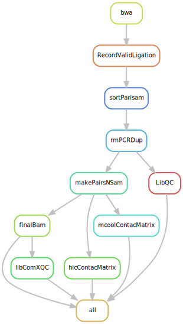
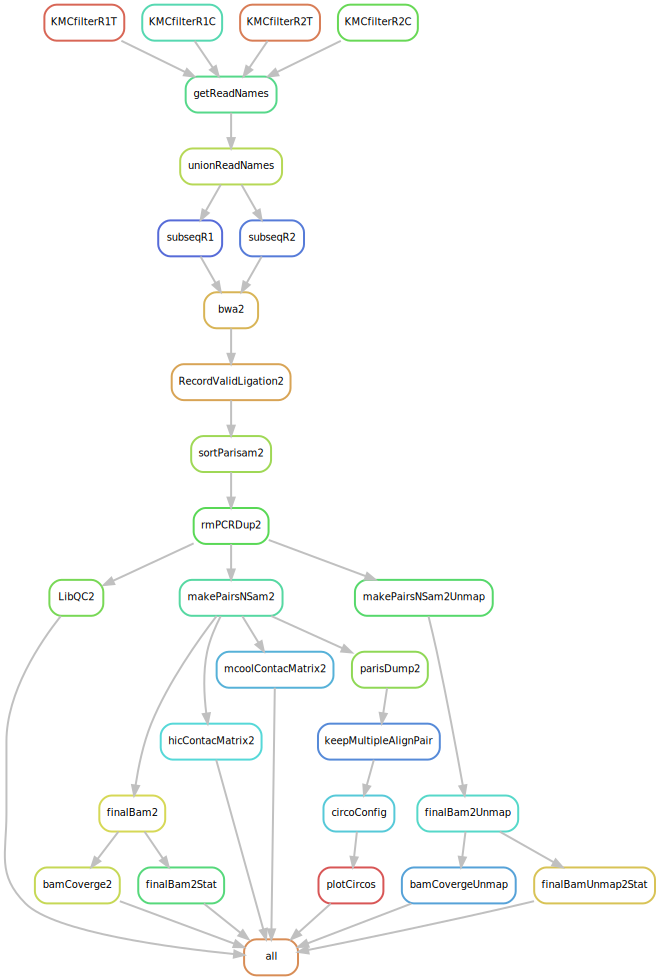

# micro-C Data Processing

A Snakemake pipeline to process micro-C data and output `.hic`, `.mcool`, and `.bam` files.

**Paper:** [Chen et al., *Aging Cell* (2024)](https://onlinelibrary.wiley.com/doi/10.1111/acel.14083)

**Micro-C documentation:** [https://micro-c.readthedocs.io](https://micro-c.readthedocs.io/en/latest/index.html)

The pipeline supports two modes, switchable by commenting/uncommenting the `include` line in the `Snakefile`:
- **General micro-C pipeline** (`workflow/pipeline.smk`) -- standard Hi-C/micro-C processing
- **Telomere-Associated micro-C pipeline** (`workflow/pipeline2.smk`) -- telomere-enriched micro-C analysis

---

## General Pipeline

A standard micro-C workflow: alignment, pair parsing, deduplication, contact matrix generation, and visualization. For detailed information, please refer to the [micro-C documentation](https://micro-c.readthedocs.io/en/latest/index.html).

**Visualization rules:**

- `bamCoverage` -- generates a bigWig coverage track for IGV.
- `circoConfig2` and `plotCircos2` -- creates a Circos plot to visualize trans interactions between genomic regions.

**Workflow:**



---

## Telomere-Associated micro-C Pipeline

This pipeline filters and analyzes sequences associated with telomeres in fastq files. The rules below outline the modifications made to the general micro-C pipeline to accommodate this analysis.

### Filtering and Alignment Rules

- `KMCfilterR1T`, `KMCfilterR1C`, `KMCfilterR2T`, `KMCfilterR2C` -- filter fastq files for reads containing telomere sequences (TTAGGG or CCCTAA) in read 1 or read 2.
- `getReadNames` and `unionReadNames` -- collect unique read names with matching telomere sequences from either read.
- `subseqR1` and `subseqR2` -- extract the matched read pairs from the original fastq files for alignment.

### Modified Alignment Rules

To rescue telomere reads in the alignment, modifications were made to the following rules:

- `RecordValidLigation2`:
    - Added `--add-columns mapq` to include mapping quality information.
    - Piped results to `pairtools select` with the condition `(mapq1 >= 40) or (mapq2 >= 40)`, allowing rescue of telomere-containing read pairs where one mate is poorly mapped due to high repetitivity. The `--walks-policy all` parameter keeps all alignment types including multiple alignments.
- `rmPCRDup2`: Added `--output-unmapped` to output unmapped reads, which are typically telomere reads that are poorly mapped due to high repetitivity. These unmapped reads are then included as telomere-associated read pairs.

### MultiQC

This pipeline generates multiple QC metrics. Run MultiQC to get a collective QC report:

```bash
multiqc results/*
```

**Workflow:**



---

## Dependencies

### Required Software and Tools

- [BWA](https://github.com/lh3/bwa)
- [pairtools](https://github.com/open2c/pairtools)
- [SAMtools](https://www.htslib.org/)
- [pairix](https://github.com/4dn-dcic/pairix)
- [cooler](https://github.com/open2c/cooler)
- [bamCoverage (deepTools)](https://deeptools.readthedocs.io/)
- [Circos](http://circos.ca/)
- [Juicer Tools](https://github.com/aidenlab/juicer)
- [KMC](https://github.com/refresh-bio/KMC) (Telomere-C pipeline only)
- [seqtk](https://github.com/lh3/seqtk) (Telomere-C pipeline only)

### Required Conda Environments

- `micro-C` -- pairtools, cooler, pairix, bgzip, circos
- `telomereC.py3.1` -- bamCoverage (deepTools)

---

## Pre-run Check

Before running the pipeline, use the pre-run check script to verify that all inputs, reference files, tools, and conda environments are available:

```bash
bash scripts/prerun_check.sh
```

This script checks:
- `fastqList.txt` format and fastq file paths
- Reference genome and BWA index files
- External scripts and tools (get_qc.py, juicer_tools, circos karyotype)
- Software in PATH (bwa, samtools, snakemake, java, python)
- Conda environments and their tools
- Snakefile configuration (which pipeline is active)

---

## Configuration

### Input Fastq Files

Edit `fastqList.txt` to specify sample names and paths to read 1 and read 2 fastq files (tab-separated):

```
sample1	/path/to/sample1.R1.fastq.gz	/path/to/sample1.R2.fastq.gz
sample2	/path/to/sample2.R1.fastq.gz	/path/to/sample2.R2.fastq.gz
```

### Circos Plots

Circos plots are generated using the template configuration file `config/circos.template.conf`. Modify this file to customize the appearance of all generated Circos plots.

### Telomere Pattern Filtering

By default, the pipeline filters for reads containing at least 10 repeats of TTAGGG or CCCTAA (60 bp total).

To customize the filtering criteria:

1. Modify the dummy fastq files in `data/dummyFastq/` (`dummy.TTAGGG.fq` or `dummy.CCCTAA.fq`).
2. Run `scripts/makeDummyKMCdb.sh` to generate new KMC databases.
3. Replace the files in `data/KMCdb/` with the new databases.
